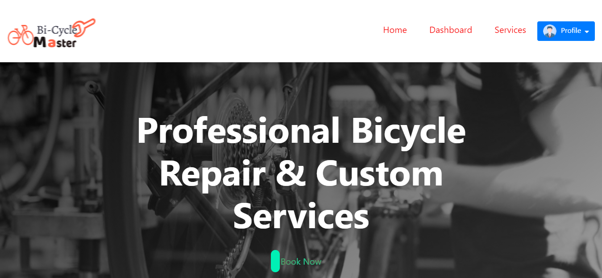

# Bi-Cycle Master

> This is Bi-Cycle Master project .

---

### Header:

- [Description](#description)
- [How To Use](#how-to-use)

---

## Description

You can get bi-cycle repair service from my website🥰🥰!!
 
Packages:  
1.Used React Framework, JavaScript
Language, Node.JS for
Backend, and MongoDB as database.  
2.Firebase for authentication.
 
3.React-bootstrap for style frontend side.
 
4.React hook form to get data from the form.   5. Particles-bg npm package for login page background style.
 

Some features of my project:  
1.This site is responsive for mobile and Desktop. 
2.In home page you will see many section.Like: Navbar,Top Banner, Feature section,About Section,Service Section,Choose Us section and Footer section etc.. 
3.Here I am use some npm package for style. 
4.Here is a admin page.which is private page just for Admin. 
5.If you Book service, you can see your Booking service in Booking List. 
6.Here I am create login page by firebase authentication. 

---

## How To Use

If you want download this project you can download zip file or clone this site.
After download you open the project in your IDE and open your terminal. Then for run this project you type in your terminal "yarn start".

---

## Live link:

-live server: - [Bi-Cycle Master](https://bicycle--master.web.app/)

## Server Side repository link:

-Backend side Link: - [Bi-Cycle Master Server Side](https://github.com/Ahsan-Ullah1871/biCycle-master-server)
